# Tarea04--SXE

## 1. Utiliza la imagen de Ubuntu tag 22 y apoyandote en esta guía sigue sus instrucciones para instalar LAMP en dicho contenedor.

### Descargamos la imagen Ubuntu en docker
Instalamos la imagen de Ubuntu con la ultima versión con el comando:

``docker pull ubuntu:22.04``

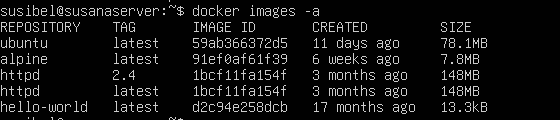

### Instalamos LAMP en un contenedor con la iamgen Ubuntu
Creamos un contenedor con la imagen de Ubuntu:

``docker run -p 5080:80 --name miubuntucontenedor httpd tail -f /dev/null``

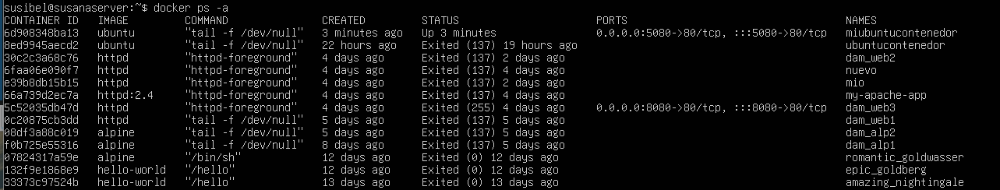

Luego accedemos a la terminal del contenedor **miubuntucontenedor** que hemos creado de la imagen Ubuntu:

``docker exec -it ubuntucontenedor bash``

En la terminal vamos a descargar el apache2 en el contenedor **miubuntucontenedor** :

``apt update``

``apt install -y apache2 apache2-utils``

Luego descargamos mariadb en el **miubuntucontenedor**:

 ``apt install -y mariadb-server mariadb-client``

Luego instalamos mysql con el siguiente comando:

``mysql_secure_installation``

> [!IMPORTANT]
> Cuando instalemos mysql nos va a pedir la contraseña del root, pero al no conocerlo tenemos  que salir de esa operación con Ctrl+C y luego ejecutar mariadb.

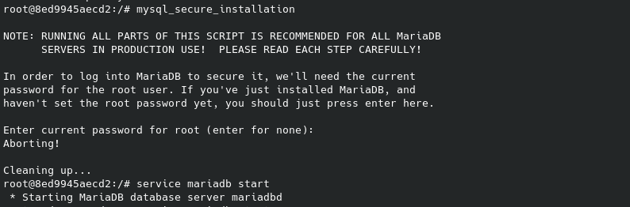

Comando para iniciarlizar mariadb:

``service mariadb start``

Luego volveremos a poner el comando ``mysql_secure_installation`` para instalarlo.

> [!CAUTION]
> Tendremos que seguir las instrucciones que apareceran de manera correcta para que el servidor se instale y no falle el root en el futuro.

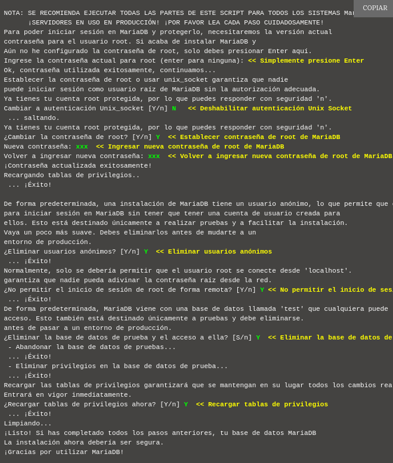

## 2. Utiliza esta guía para instalar wordpress en el contenedor.
Seguimos en la terminal del contenedor y descargamos php con los siguientes comandos.

``apt install -y php php-mysql libapache2-mod-php``

``service apache2 restart``

Una vez descargado php, vamos a instalar wordpress en el contenedor. Creamos el directorio de instalación y descargamos el archivo desde WordPress.org con los siguientes comandos:

``apt install curl``

``apt install nano``

``curl https://wordpress.org/latest.tar.gz | tar zx -C /srv/www``

Creamos un sitio en Apache para Wordpress entrando en el archivo de configuración.

``nano /etc/apache2/sites-available/wordpress.conf``

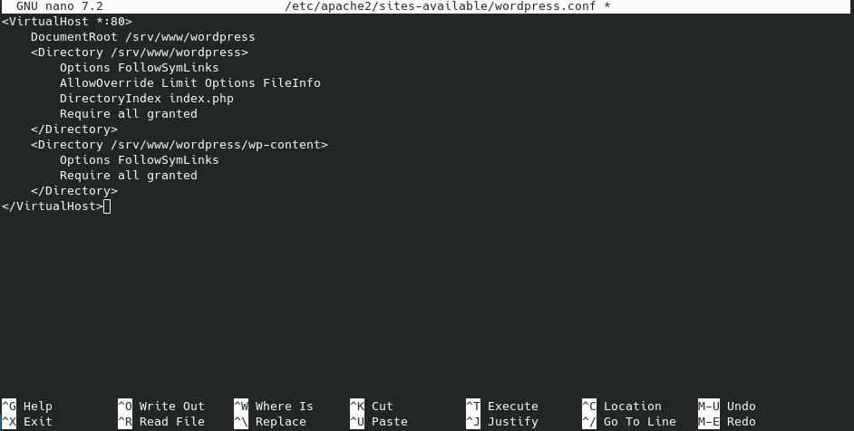

Habilitamos el sitio con el siguiente comando:

``a2ensite wordpress``

Habilitamos la reescritura de URL con el siguiente comando:

``a2enmod rewrite``

Deshabilite el sitio predeterminado “It Works” con:

``a2dissite 000-default``

Para aplicar los cambios vamos a recargar Apache:

``service apache2 reload``

Luego configuramos la base de datos, entramos a la terminal de la base con el siguiente root para crearla:

``mysql -u root``

Vamos a crear una base con su user y la configuramos para usarla con wordpress.

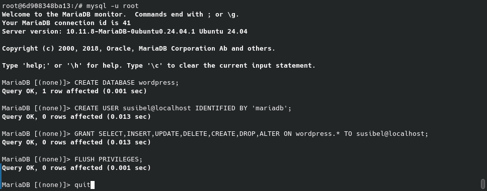

Una vez terminada la configuración de la base de datos, salos con ``quit``

Ahora vamos a configurar wordpress para conectarlo con la base de datos, ingresamos los siguientes comandos:

``cp /srv/www/wordpress/wp-config-sample.php /srv/www/wordpress/wp-config.php``

``sed -i 's/database_name_here/wordpress/' /srv/www/wordpress/wp-config.php``

``sed -i 's/username_here/susibel/' /srv/www/wordpress/wp-config.php``

``sed -i 's/password_here/mariadb/' /srv/www/wordpress/wp-config.php``

Luego vamos a modificar el archivo de configuración de wordpress:

``nano /srv/www/wordpress/wp-config.php``

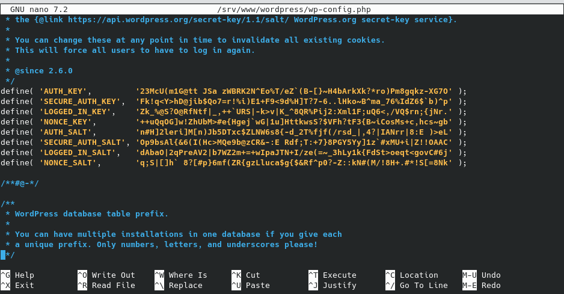

## 3. Comprueba que puedes acceder a wordpress. 
Vamos a comprobar si la instalación de wordpress tuvo éxito. En un navegador abrimos la página con el localhost y puerto del contenedor. http://10.0.9.143:5080 Vamos a configurar el wordpress añadiendo el título de la página, nombre de usuario, contraseña y un correo electrónico.

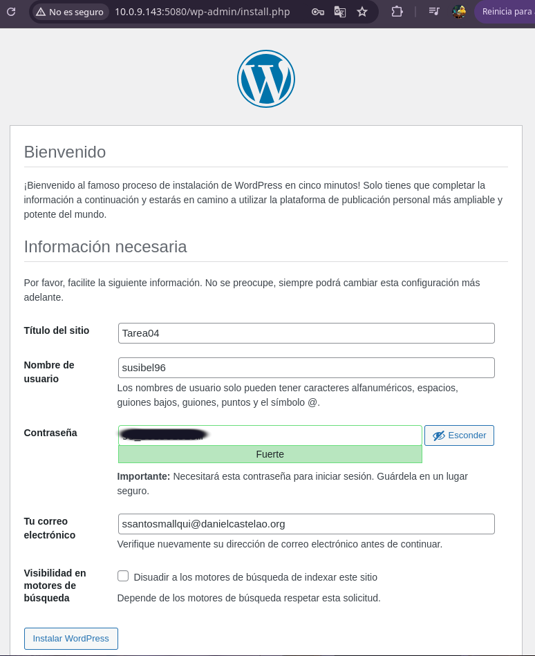

Una vez rellenado los datos, instalamos wordpress, aparecerá una imagen de confirmación.

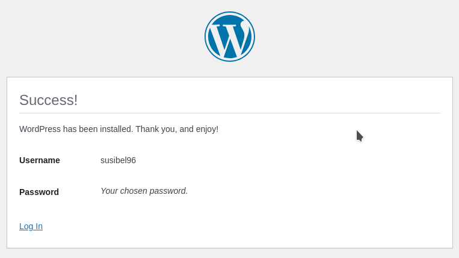

Luego podremos ingresar a wordpress iniciando sesión en  http://10.0.9.143:5080/wp-login.php 

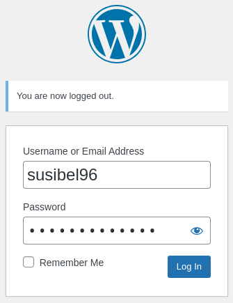

Luego de iniciar sesión ingresará en el panel de control de wordpress.

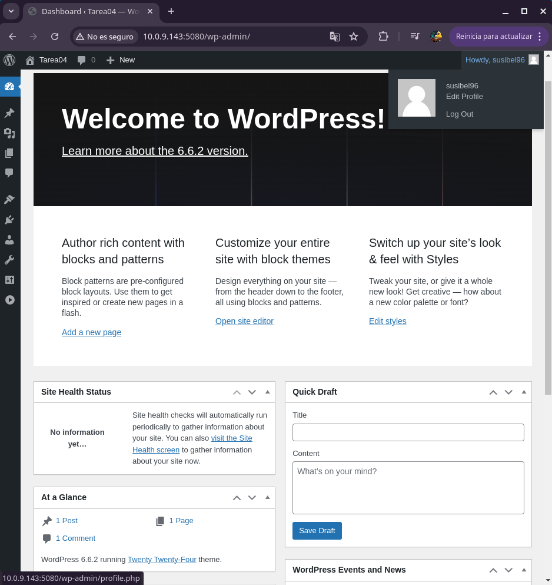

## OPCIONAL: Instala phpmyadmin
Vamos a instalar phpmyadmin en el contenedor, para ello usamos los siguientes comandos:

``apt install phpmyadmin``

> [!NOTE]
> Cuando se esté instalando phpmyadmin te permitira seleccionar el servidor web, el cual escogeremos a apache2.

### Comprobación

Una vez instalado el servidor vamos a ir al navegador y ponemos el IP y el puerto del contenedor junto con /phpmyadmin
http://10.0.9.143:5080/phpmyadmin

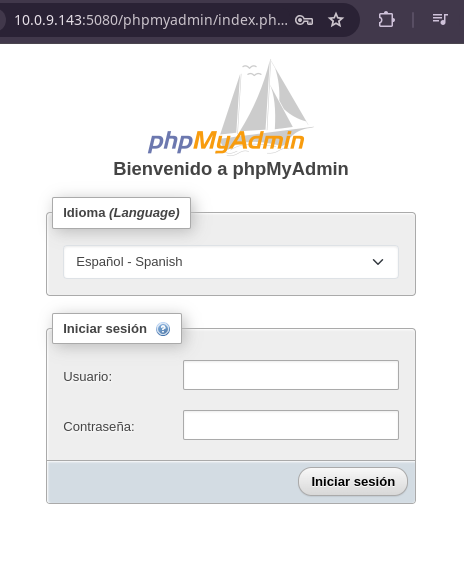

Se deberá introducir el usuario y contraseña que se puso a la base de datos y podra acceder a su base.

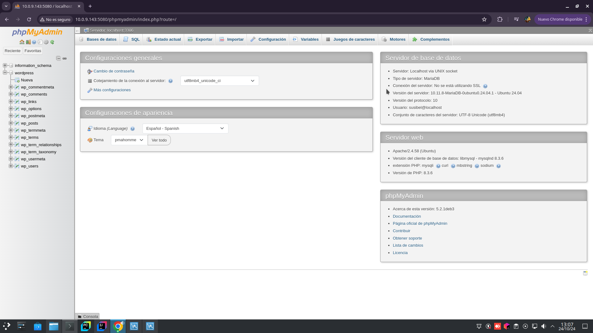

